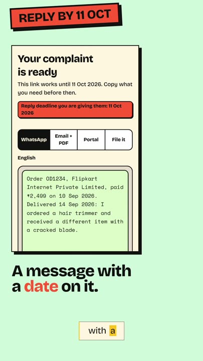

# Nyay Patra

A free, no-login tool that turns a plain description of a stuck refund into a ready-to-send WhatsApp message, a formal email, and the exact fields for the company's complaint portal — in English or Hindi.

Live: **https://nyaypatra.vercel.app**

No AI model in the loop. The letters come from deterministic template logic in `packages/core`, not an LLM — same input, same output, every time.

## Watch it in 90 seconds

[](media/nyaypatra-promo.mp4)

Click the picture to play the promo (93s, sound on).

## Layout

npm workspaces monorepo:

- `apps/web` — the Next.js app (landing page, intake form, packet page). See [`apps/web/README.md`](apps/web/README.md) for build, deploy, and storage configuration.
- `packages/core` — the letter-generation logic: templates, deadline/date math, money and UTR formatting, packet assembly. No framework dependency.
- `packages/ui` — shared UI components used by `apps/web`.

## Local development

```
npm install
npm run dev -w @nyaypatra/web
```

Without `DATABASE_URL` set, the web app stores packets in memory (fine for local dev — lost on restart, never use this in production). See `apps/web/.env.example` for the full list of environment variables and `apps/web/README.md` for what each one does.

## Common commands

```
npm run build       # build all workspaces
npm run test         # run all workspace test suites
npm run typecheck    # typecheck all workspaces
```

Run a single workspace's script with `-w @nyaypatra/web` or `-w @nyaypatra/core`.

## Deployment

Deployed on Vercel with a Neon Postgres database. `apps/web/README.md` has the full configuration contract (required env vars, cron cleanup, proxy-hop settings). Each app in this monorepo that gets deployed should have its own dedicated Vercel project — never share one across unrelated apps.
